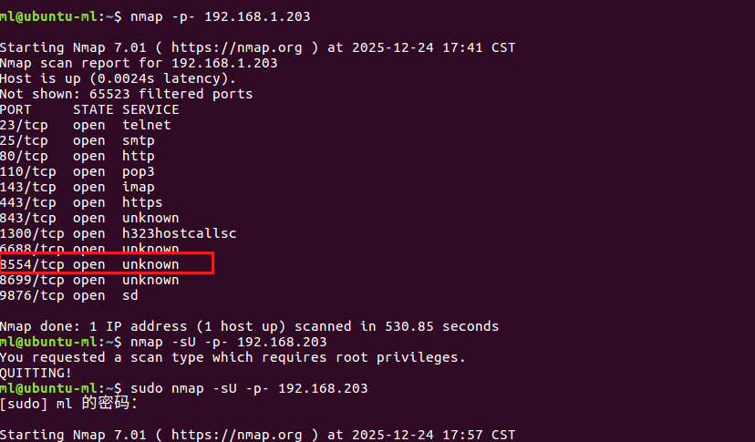

Tenda IC7-PRS RTSP Real-time Video Stream Access Vulnerability

The Tenda smart dome camera (IC7-PRSV1.0 2201101520) contains hard-coded default credentials for RTSP streams that cannot be modified via the mobile app. An attacker with access to the same network can access the camera's real-time video stream and view the footage using the RTSP protocol.

Scanned all ports accepting TCP and UDP using nmap.

  

Network mapping reveals that, in addition to accepting Telnet connections on port 23/TCP, the camera exposes port 8554/TCP for protocol stream connections. Consequently, the service can be accessed via RTSP using default credentials; since these credentials are hard-coded into the configuration file, they cannot be modified through the mobile app. Therefore, an attacker connected to the same manufacturer's network can access the real-time video stream and view the footage.
