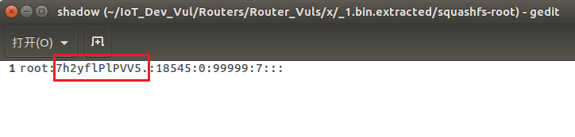
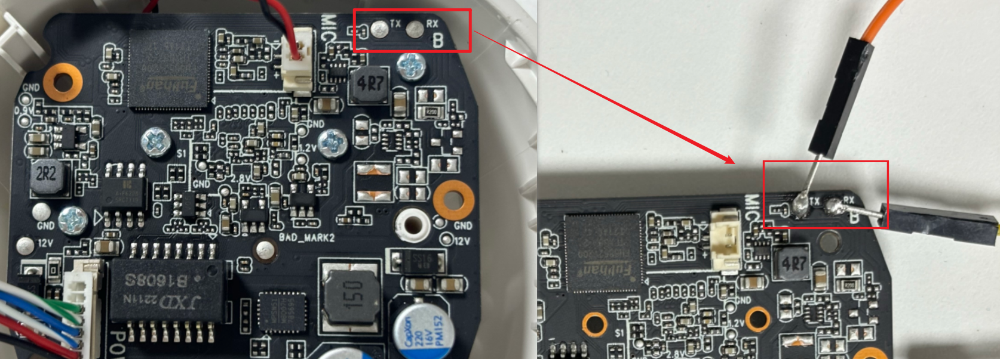
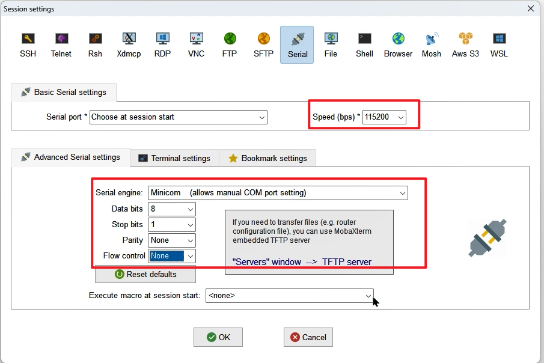
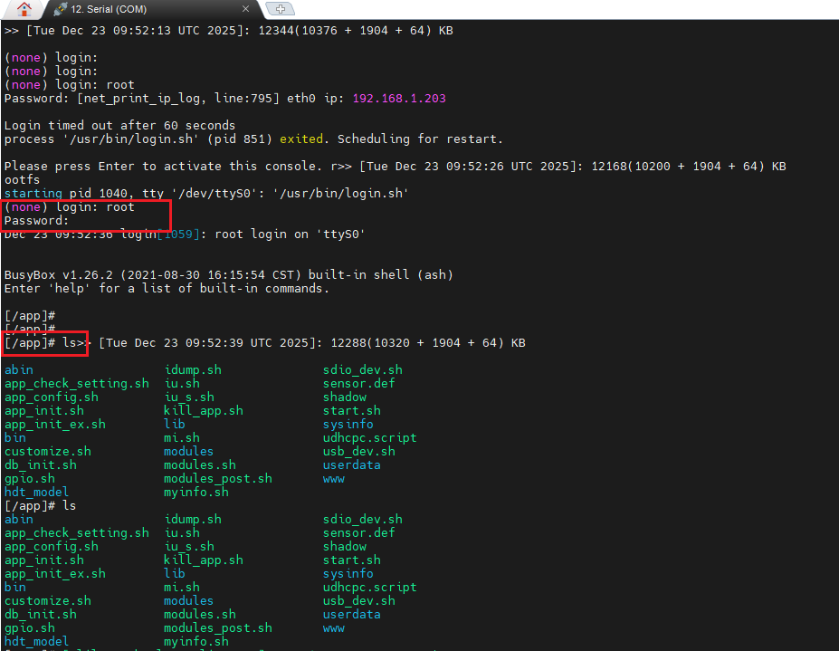

Tenda IC7-PRS Physical Access Bootloader Vulnerability

By leveraging physical access to the UART serial interface on the Tenda IC7-PRSV1.0 (firmware version 2201101520) dome camera, an attacker can access the bootloader and gain root access to the U-Boot console by interrupting the U-Boot process and entering a hardcoded boot password.

According to the user manual, the camera's default login IP address is 192.168.1.203.
Locate the `shadow` file within the extracted firmware; it contains the hard-coded hash for the `root` user. Decrypting this hash reveals the password: `tdrootfs`.

  

Disassemble the device to locate the UART serial port's transmit (TX) and receive (RX) pads, which are exposed via pins; then, establish a connection using a USB-to-TTL adapter and minicom.

  

Connect via Serial in MobaXterm.

  

By connecting to the camera via the UART interface, you can access the U-Boot output; interrupting the U-Boot boot process and entering the decrypted password grants root access to the U-Boot console.

  

