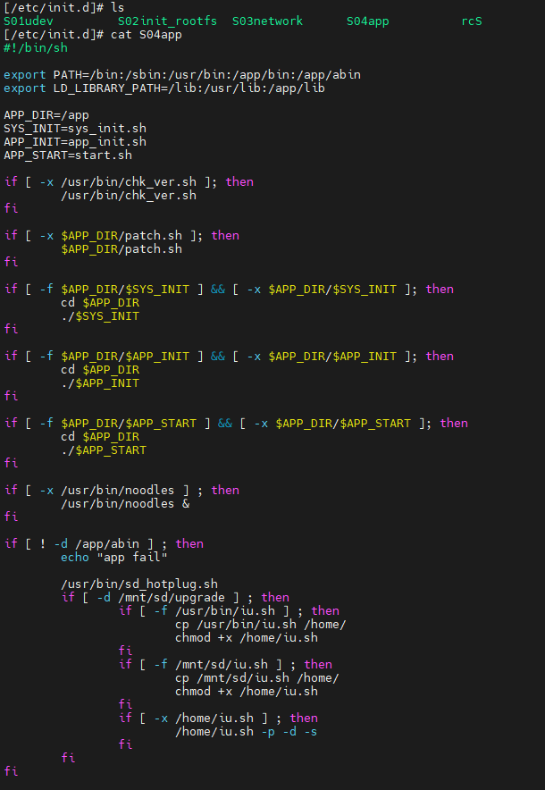
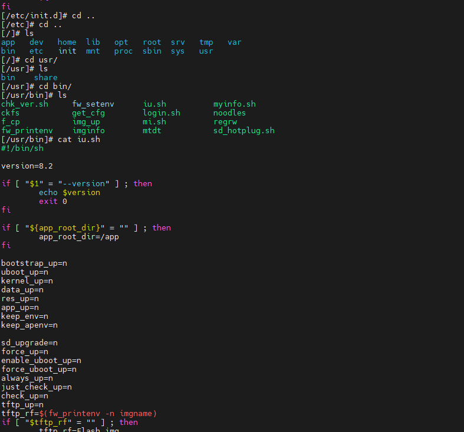
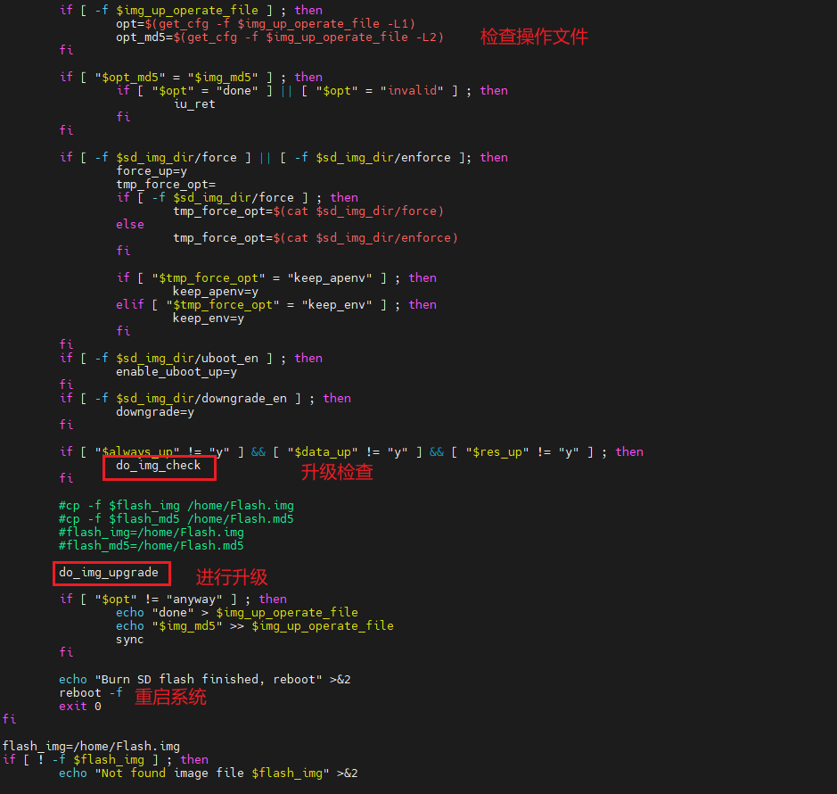

Tenda IC7-PRS Malicious Firmware Upgrade Vulnerability

A vulnerability exists in the firmware update mechanism of the Tenda smart dome camera (IC7-PRSV1.0 2201101520). By maliciously modifying the firmware and triggering the update process, an attacker can overwrite the official firmware and prevent future updates. Since the firmware modification is permanent, the attacker gains long-term control over the device, rendering it unable to return to its normal state.

Five bash scripts were found in the `/etc/init.d` directory. An examination of `S04app` revealed that it is responsible for mounting the application file system, initializing various applications, and specifically launching the `noodles` application.

  

Analysis reveals that the script `chk_ver.sh` is invoked to update all scripts in the `/usr/bin` directory to the versions located in the `/app` directory; upon execution of the `/usr/bin/noodles` application, the system detects the SD card and mounts it to `/mnt/sd`, subsequently executing `iu.sh` once the mount is successful.

  
  

Further analysis reveals that the `iu.sh` script copies the contents of the SD card's `Flash.img` file to `/home` and then performs a replacement. Since the system boot process does not verify the integrity of the loaded image, simply inserting a correctly formatted SD card containing a malicious firmware image allows the system to be overwritten—without requiring network access to the device.
