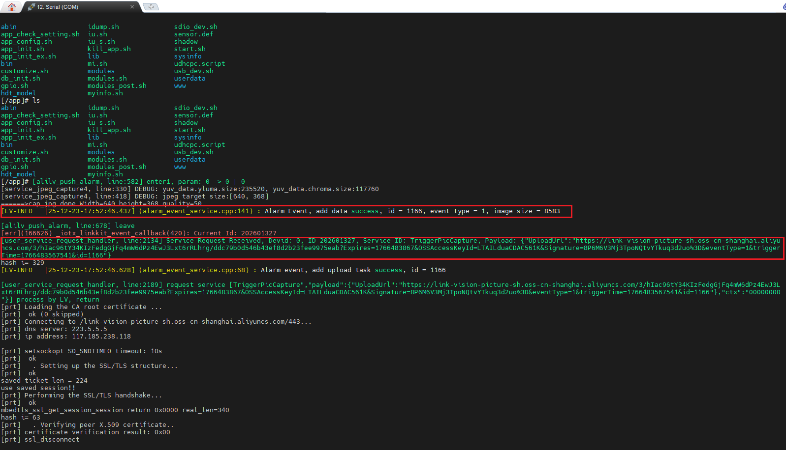

Tenda IC7-PRS Network Credential Leakage Vulnerability

The firmware (version IC7-PRSV1.0 2201101520) for the Tenda "conch-style" camera allows an attacker to gain root access to the U-Boot console by interrupting the U-Boot process and entering a hardcoded boot password. Since the credentials are printed in plaintext within the logs, an attacker can obtain them to access files on the OSS, as well as perform upload or download operations; this leads to data leakage and misuse, thereby increasing the risk of system compromise.

After gaining root access to the Tenda IC7-PRS via a bootloader vulnerability requiring physical access, it was discovered that the network connection credentials are printed in plaintext, creating a risk of data leakage and system compromise.

  

