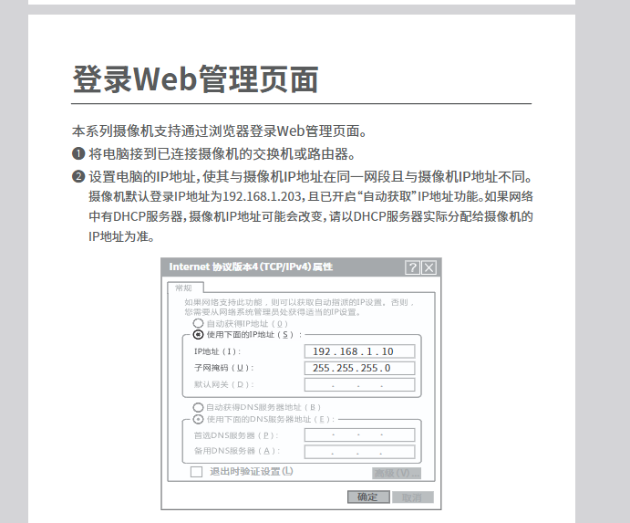
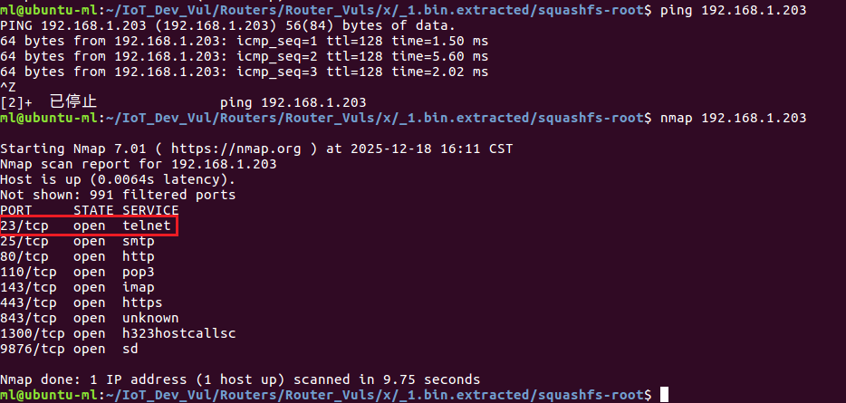
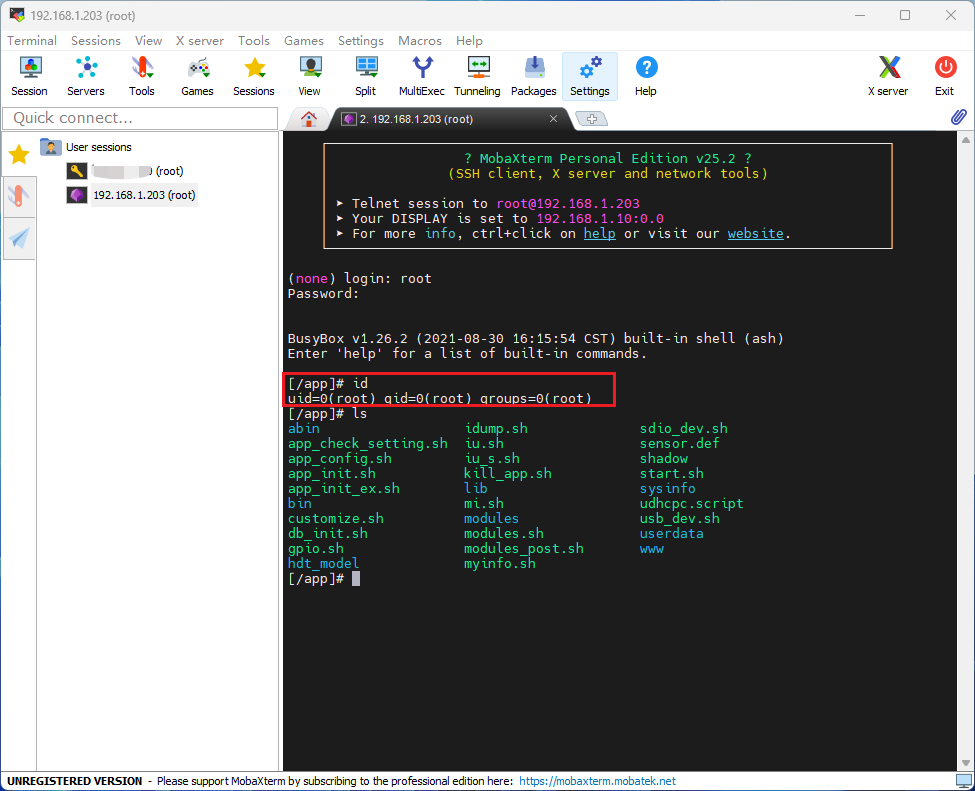

Tenda IC7-PRS Hardcoded Password Vulnerability

The firmware (version 2201101520) for the Tenda IC7-PRSV1.0 smart turret camera contains a hardcoded default password for the root user, which is stored using weak encryption. Unauthorized access—leading to a full device compromise—can be achieved by using these credentials to log in via Telnet or the UART interface and gain root-level privileges.

According to the user manual, the camera's default login IP address is 192.168.1.203.

  

Locate the `shadow` file within the extracted firmware; it contains the hardcoded hash for the root user. Decrypting this hash reveals the password: `tdrootfs`.

  

Scan common port numbers using nmap and observe that the Telnet service is open.

  

Connect via MobaXterm and log in as the root user to gain full access to the device.

  

