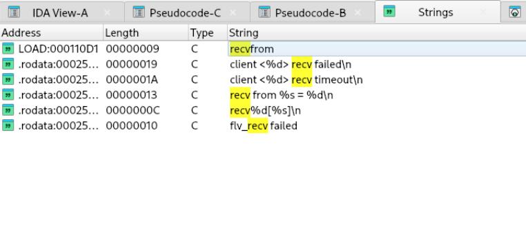
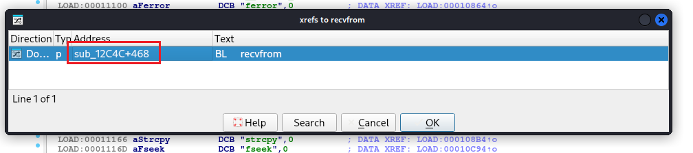
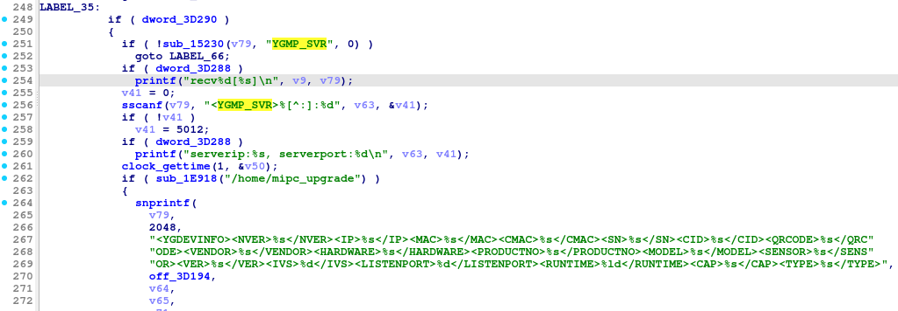
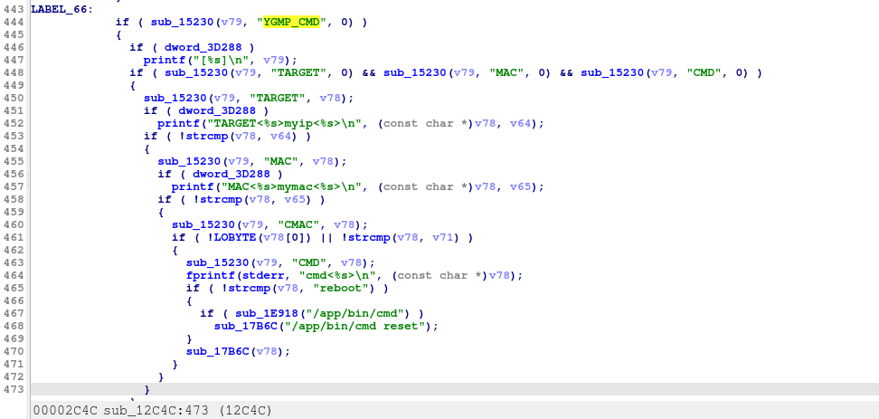
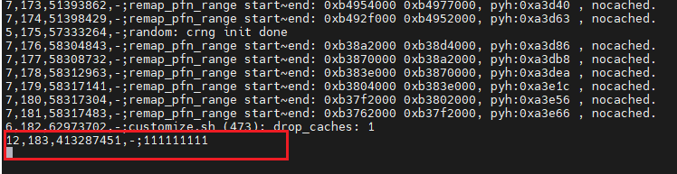
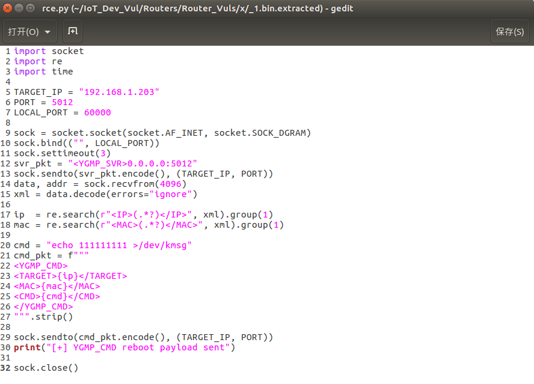

Tenda IC7-PRS Remote Code Execution Vulnerability

The Tenda smart dome camera IC7-PRSV1.0 (model 2201101520) exposes the YGMP service on UDP port 5012. When processing the `<YGMP_CMD>` command, the service performs validation based on the IP/MAC fields returned by `<YGMP_SVR>` but implements no authentication or access control. Consequently, an attacker can execute arbitrary commands without authentication.

Use `strings` to search for unsafe functions that handle external connections, such as `recv`, `recvfrom`, and `recvmsg`.

  
  

Tracing the cross-reference from `recvfrom` leads to `sub_12C4C`, which is identified as a multicast thread created and started by the main function; during its initialization phase, it is bound to UDP port 5012.
At the same time, the commands configured for the multicast_thread are YGMP_SVR and YGMP_CMD.

  
  

Upon receiving the YGMP_SVR command, "noodles" reads the device's current settings and returns information—such as the device IP, MAC address, and serial number—to the caller in an XML structure.
The YGMP_CMD command allows an attacker to achieve remote code execution (RCE) on the camera without authentication by sending a specially crafted XML packet.
It supports three tags: TARGET, MAC, and CMD; the CMD tag directly influences the core control logic without undergoing effective filtering or validation.
Analysis reveals that the `sub_12C4C` function merely performs simple encapsulation, meaning the parameters passed to it are forwarded for execution without effective filtering or sanitization.
Consequently, this enables an attacker to achieve RCE without authentication.

Execute the PoC after writing it:
Write a series of '1's to /dev/kmsg
python rce.py

  
  

